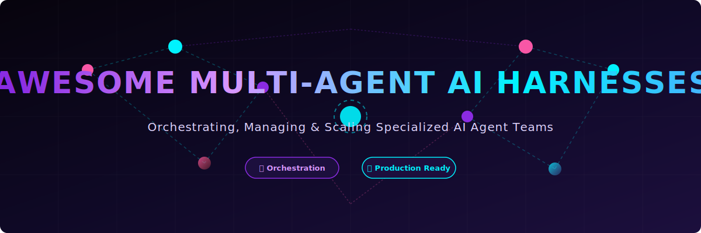

# 🤖 Awesome Multi-Agent AI Harnesses 🚀

  

 

> 🌐 **The ultimate curated directory of state-of-the-art Multi-Agent AI Harness Systems, Frameworks, and SaaS Platforms.**  
> Orchestrate, manage, and scale teams of collaborative, specialized AI agents to solve complex reasoning and engineering challenges.

---

## 🌟 Top Multi-Agent AI Harness Systems Ecosystem

**Focused on Orchestrating, Managing & Running Multi-Agent AI Systems**  
*Last updated: March 2026*

This repository tracks notable **platforms** and **open-source projects** building **Multi-Agent AI Harness Systems**. These frameworks allow developers to orchestrate teams of specialized AI agents that collaborate, reason together, delegate tasks, maintain shared memory, and solve complex problems through structured workflows.

### 🎯 Key Focus Areas:
- **Agent Orchestration & Coordination** 🤝
- **State Management & Persistence** 💾
- **Human-in-the-Loop (HITL) Support** 👤
- **Tool Use & Function Calling** 🛠️
- **Production Reliability & Scalability** 📈

---

## 📖 Table of Contents
- [🏢 SaaS Products](#-saas-products)
  - [💰 Pricing Overview](#-pricing-overview)
- [💻 Open-Source GitHub Projects](#-open-source-github-projects)
- [🤝 How to Contribute](#-how-to-contribute)
- [⚖️ Disclaimer](#-disclaimer)
- [📊 Star History](#-star-history)

---

## 🏢 SaaS Products

### 💰 Pricing Overview

| Product | Pricing | Free Tier / Limit | Company Size (Valuation / Revenue) |
| :--- | :--- | :--- | :--- |
| **[Claude Code](https://claude.ai/)** | $20/mo (Claude Pro) or API | Limited by Pro subscription or API credits | ~$965B Valuation ($47B ARR) |
| **[OpenAI Agents SDK](https://openai.com/)** | Free (Pay-as-you-go API) | Dependent on OpenAI API credits | ~$852B Valuation ($24B ARR) |
| **[Cursor](https://cursor.com/)** | $20/mo (Pro), $60/mo (Pro+) | 2,000 completions/mo, limited agent requests | $60B Valuation ($3B ARR) |
| **[Langflow Cloud](https://www.langflow.org/)** | Free (Managed by DataStax) | Free (Pay for 3rd party LLMs/DBs) | $1.6B Valuation (Acquired by IBM) |
| **[LangGraph Cloud](https://www.langchain.com/langgraph)** | $39/user/mo (Plus) | 1 Free Dev deployment, ~5k traces/mo | $1.25B Valuation |
| **[Dify Cloud](https://dify.ai/)** | $59/mo (Pro), $159/mo (Team) | 200 message credits, 5 apps | $180M Valuation |
| **[CrewAI Cloud](https://www.crewai.com/)** | $25/mo (Pro) | 50 executions/mo (Free) | ~$100M Valuation ($18M Funding) |
| **[Phidata (Agno)](https://www.agno.com/)** | $30/mo per seat | OSS is Free; Cloud has limited free connections | Seed Stage (Estimated ~$20M - $50M) |
| **[Archon](https://archon.ai/)** | Free / Open-Source (BYOK) | Free (Pay LLM provider only) | N/A (Open-Source Project) |
| **[OpenHarness](https://github.com/HKUDS/OpenHarness)** | Free (OSS) | Free (Supports Copilot/Claude Pro) | N/A (Academic / OSS) |

### 🚀 Core Multi-Agent Harness Platforms

- **[Archon](https://archon.ai/)**  
  Advanced multi-agent orchestration platform designed for complex task decomposition and agent collaboration.

- **[Claude Code](https://claude.ai/)**  
  Anthropic’s native multi-agent system with powerful team-based coding and reasoning capabilities.

- **[Cursor](https://cursor.com/)**  
  AI-first code editor with built-in multi-agent workflows and agentic coding features.

- **[OpenAI Agents SDK](https://openai.com/)**  
  Official SDK for building and deploying multi-agent systems with strong orchestration primitives.

### 🛠️ Advanced Platforms

**Other notable mentions**: OpenHarness and various enterprise agent platforms.

---

## 💻 Open-Source GitHub Projects

### 🏗️ Dedicated Multi-Agent Harness Systems

- **[Langflow](https://github.com/langflow-ai/langflow)**   
  Visual low-code platform for building and orchestrating multi-agent workflows on top of LangChain.

- **[OpenDevin](https://github.com/OpenDevin/OpenDevin)**   
  Community-driven open-source autonomous AI software engineer platform with multi-agent capabilities.

- **[MetaGPT](https://github.com/geekan/MetaGPT)**   
  Multi-agent framework that simulates a software company with specialized roles for complex project execution.

- **[AutoGen](https://github.com/microsoft/autogen)**   
  Microsoft’s powerful multi-agent conversation framework that enables dynamic, flexible agent interactions and group chats.

- **[CrewAI](https://github.com/crewAIInc/crewAI)**   
  Popular role-based multi-agent orchestration framework. Extremely developer-friendly for creating collaborative agent teams with clear roles and goals.

- **[Phidata](https://github.com/phidatahq/phidata)**   
  Framework for building production-grade agents with memory, knowledge, and tools. Excellent for multi-agent systems.

- **[LangGraph](https://github.com/langchain-ai/langgraph)**   
  The leading open-source framework for building stateful, controllable multi-agent applications with cycles, persistence, and human-in-the-loop support.

- **[SWE-agent](https://github.com/princeton-nlp/SWE-agent)**   
  Specialized agent harness for software engineering tasks that autonomously interacts with code repositories.

- **[Camel-AI](https://github.com/camel-ai/camel)**   
  Communicative agent framework focused on role-playing and cooperative problem solving between agents.

### 🌟 Additional Strong Open-Source Options

- **[Dify](https://github.com/langgenius/dify)**  — Open-source AI workflow and multi-agent platform with visual builder.
- **[DSPy](https://github.com/stanfordnlp/dspy)**  — Programming framework for optimizing multi-agent and multi-step systems.
- **[Semantic Kernel](https://github.com/microsoft/semantic-kernel)**  — Microsoft’s orchestration framework with planners and plugins.
- **[Haystack](https://github.com/deepset-ai/haystack)**  — Production-ready pipelines with strong agent orchestration.
- **[Letta (MemGPT)](https://github.com/letta-ai/letta)**  — Advanced memory management for long-running multi-agent systems.

**Pro Tip:** Combine **LangGraph** + **CrewAI** + **AutoGen** with **Ollama** / **vLLM** for fully local, scalable multi-agent harnesses.

---

## 🤝 How to Contribute

1. Fork the repo.
2. Add/edit entries in `README.md` (follow existing format).
3. Include: name, link, 1–2 sentence description, and whether it's SaaS or open-source.
4. Submit PR with a short explanation.

**Give us a star ⭐ if you find this list useful!**

---

## 🔍 See Also

- **[AI CLI Coding Agents](https://github.com/ishandutta2007/Awesome-CLI-Coding-Agents)**
- **[AI IDE](https://github.com/ishandutta2007/Awesome-AI-IDE)**
- **[AI IDE Extensions](https://github.com/ishandutta2007/Awesome-AI-IDE-Extensions)**
- **[AI Code Editors(All kind)](https://github.com/ishandutta2007/Awesome-AI-Code-Editor)**

---

## 📊 Star History

	<a href="https://www.star-history.com/?repos=ishandutta2007%2FAwesome-Multi-Agent-AI-Harnesses&type=date&legend=bottom-right">
	 <picture>
	   <source media="(prefers-color-scheme: dark)" srcset="https://api.star-history.com/chart?repos=ishandutta2007/Awesome-Multi-Agent-AI-Harnesses&type=date&theme=dark&legend=bottom-right" />
	   <source media="(prefers-color-scheme: light)" srcset="https://api.star-history.com/chart?repos=ishandutta2007/Awesome-Multi-Agent-AI-Harnesses&type=date&legend=bottom-right" />
	   
	 </picture>
	</a>

---

## ⚖️ Disclaimer

- This is a **community-curated** list — not exhaustive and not an endorsement.
- Multi-agent systems can be computationally expensive. Monitor costs and resources carefully.
- Always implement proper guardrails and human oversight for production use cases.

---

**Made for AI engineers, agent builders, and developers creating complex intelligent systems.**  
*Let's make multi-agent orchestration more powerful, controllable, and open.*
